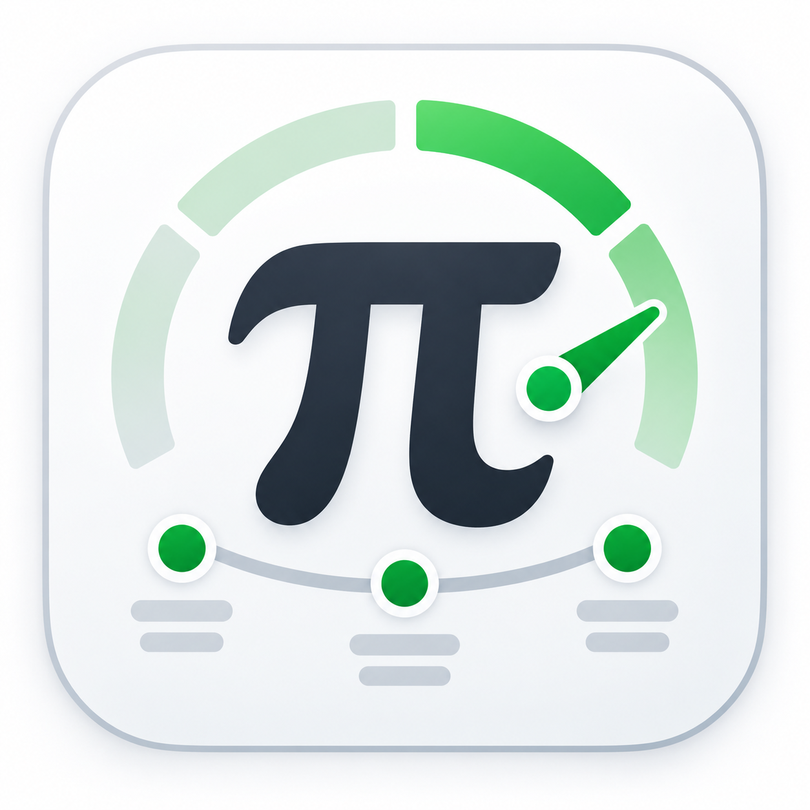

# Pi Node Dashboard



**Pi Node Dashboard** is an unofficial, community-built Linux dashboard for monitoring a local Pi Node.

It provides a simple graphical interface for checking node status, Horizon synchronization, peer connections, system usage, wallet information, claimable balances, transaction details, CPU limits, and Docker logs.

Current version: **1.1**

---

## Features

- Pi Node container status
- Protocol synchronization status
- Horizon synchronization status
- Current block and quorum block
- Incoming and outgoing authenticated peers
- CPU usage
- CPU limit and selectable CPU profiles
- RAM usage
- Disk usage
- Container uptime
- Wallet balance overview
  - Free balance
  - Locked / claimable balance
  - Mainnet total
- Claimable balance unlock dates
- Recent transactions
- Transaction operation details
- Node log viewer
  - 100 / 200 / 500 / 1000 lines
  - Refresh logs
  - Copy logs
  - Clear log view
- Configurable automatic refresh interval
- Live language switching without restarting the dashboard
- Automatic system-language detection on first start
- English fallback when the system language is not supported

---

## Languages

Pi Node Dashboard currently includes:

- Nederlands
- English
- Deutsch
- Español
- Français
- Italiano
- Português
- Polski
- Türkçe
- Bahasa Indonesia
- Tiếng Việt
- 简体中文
- 日本語
- 한국어

Language files are stored separately in the `lang/` directory.

This means translations can be corrected or new languages can be added without changing the Python source code.

If a language is not supported, Pi Node Dashboard falls back to English.

---

## Requirements

Pi Node Dashboard is currently intended for Linux systems running a local Pi Node.

You need:

- Linux
- Pi Node installed and configured
- Docker
- A running Pi Node container named `mainnet`
- Python 3 when running from source

The application uses the local Pi Node CLI, Docker, and the local Horizon API.

---

## Installation

### Debian / Ubuntu / Linux Mint

For normal users, the recommended installation method is the `.deb` package from the GitHub Releases page.

Download the latest release and install it with:

```bash
sudo apt install ./PiNodeDashboard-1.1-amd64.deb
```

After installation, start **Pi Node Dashboard** from your application menu.

> The exact package filename may change between releases.

---

## Running from source

Clone the repository:

```bash
git clone https://github.com/wolfie7009/pi-node-dashboard.git
cd pi-node-dashboard
```

Create a virtual environment:

```bash
python3 -m venv .venv
source .venv/bin/activate
```

Install the Python dependencies:

```bash
pip install PySide6 requests
```

Start the dashboard:

```bash
python main.py
```

---

## Configuration

User settings are stored in:

```text
config.json
```

Typical settings include:

```json
{
  "wallet_address": "",
  "refresh_minutes": 10,
  "cpu_limit": 0,
  "language": "en"
}
```

`config.json` is intentionally excluded from Git because it may contain user-specific information such as a public wallet address.

When no language has been saved yet, Pi Node Dashboard checks the Linux system language.

If the detected language exists in `lang/`, it is selected automatically. Otherwise English is used.

---

## CPU profiles

Pi Node Dashboard can change the CPU limit of the `mainnet` Docker container.

Available profiles include:

- Unlimited
- Maximum 4 cores
- Maximum 3 cores
- Maximum 2 cores

The selected limit is applied using Docker and only affects the Pi Node container.

---

## Wallet details

When a public Pi wallet address is configured, the dashboard can show:

- Free Mainnet balance
- Locked / claimable balances
- Mainnet total
- Unlock conditions and dates
- Recent transactions
- Transaction details
- Operation details

The wallet address is public information, but it is still stored only in the local configuration and is not included in this repository.

---

## Node logs

The **Node Logs** tab reads logs from the local `mainnet` Docker container.

You can choose how many recent lines to display:

- 100
- 200
- 500
- 1000

Logs are loaded when the tab is opened for the first time and can then be refreshed manually.

---

## Adding or improving a translation

Translations are simple JSON files inside:

```text
lang/
```

For example:

```text
lang/en.json
lang/nl.json
lang/de.json
```

To add a new language:

1. Copy `lang/en.json`.
2. Rename it to the appropriate ISO language code, for example:

```text
sv.json
```

3. Translate the values, but **do not change the keys**.
4. Keep placeholders such as `{value}`, `{cores}`, `{date}`, `{minutes}`, and `{error}` unchanged.
5. Start Pi Node Dashboard again.

The new language will automatically appear in the language selector.

Pull requests with translation improvements or new languages are welcome.

---

## Project structure

```text
pi-node-dashboard/
├── assets/
│   └── pi-dashboard.png
├── lang/
│   ├── en.json
│   ├── nl.json
│   └── ...
├── services/
│   ├── horizon.py
│   └── pi_node.py
├── ui/
│   ├── about.py
│   ├── dashboard.py
│   ├── node_logs.py
│   ├── settings.py
│   ├── transaction_details.py
│   ├── wallet_details.py
│   └── widgets.py
├── utils/
│   ├── config.py
│   ├── i18n.py
│   └── paths.py
└── main.py
```

---

## Privacy and security

Pi Node Dashboard does **not** require your wallet private key or node seed.

Do not add private keys, wallet passphrases, node seeds, passwords, or other secrets to the source code, `config.json`, issues, screenshots, or pull requests.

The application is designed to work with a **public wallet address** only.

---

## Contributing

Contributions are welcome.

Useful contributions include:

- Translation improvements
- New language files
- UI improvements
- Bug fixes
- Linux packaging improvements
- Better log handling
- Documentation
- Testing on other Linux distributions

If you find a bug, please open a GitHub issue and include:

- Linux distribution
- Pi Node Dashboard version
- What you expected
- What happened
- Relevant error output or logs

Please remove wallet addresses and other personal information from screenshots or logs before posting them publicly.

---

## License

Pi Node Dashboard is released under the **MIT License**.

See the `LICENSE` file for details.

---

## Disclaimer

Pi Node Dashboard is an **unofficial community project**.

It is not affiliated with, endorsed by, or an official product of Pi Network or its developers.

Use it at your own risk.

The software interacts with your local Pi Node, Docker container, local Horizon API, and public wallet information. Always review changes before using them on an important system.
